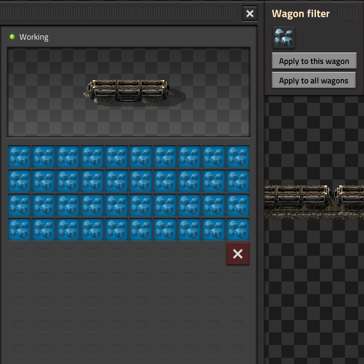

# Quick Wagon Filter

## Overview

Quick Wagon Filter is a Factorio mod designed to streamline the process of setting inventory filters for cargo wagons in trains. It provides a convenient window for selecting an item and applying it as a filter to either a single wagon or all wagons in a train.

## Why?

Manually setting filters for each inventory slot in a wagon can be tedious and time-consuming. Quick Wagon Filter simplifies this process, allowing you to set filters with just a few clicks.

## How to Use

1. Open the inventory of a cargo wagon in your train.
2. Use the mod's window to choose an item.
3. Click "Apply to this wagon" to set the chosen item as a filter for the current wagon.
4. Alternatively, click "Apply to all wagons" to apply the filter to all wagons in the train.

## Manual Installation

1. Download the mod from [Mod Portal](https://mods.factorio.com/mod/quick-wagon-filter).
2. Place the downloaded ZIP file into the "mods" folder of your Factorio installation.
3. Launch Factorio and enable the mod in the mod settings.

## Feedback and Contributions

Feedback, bug reports, and contributions are welcome! Feel free to [open an issue](https://github.com/Syt-ha/factorio-mod-quick-wagon-filter/issues) or submit a pull request.

## License

This mod is licensed under the [GNU Lesser General Public License](https://www.gnu.org/licenses/lgpl-3.0.en.html).

Happy filtering!